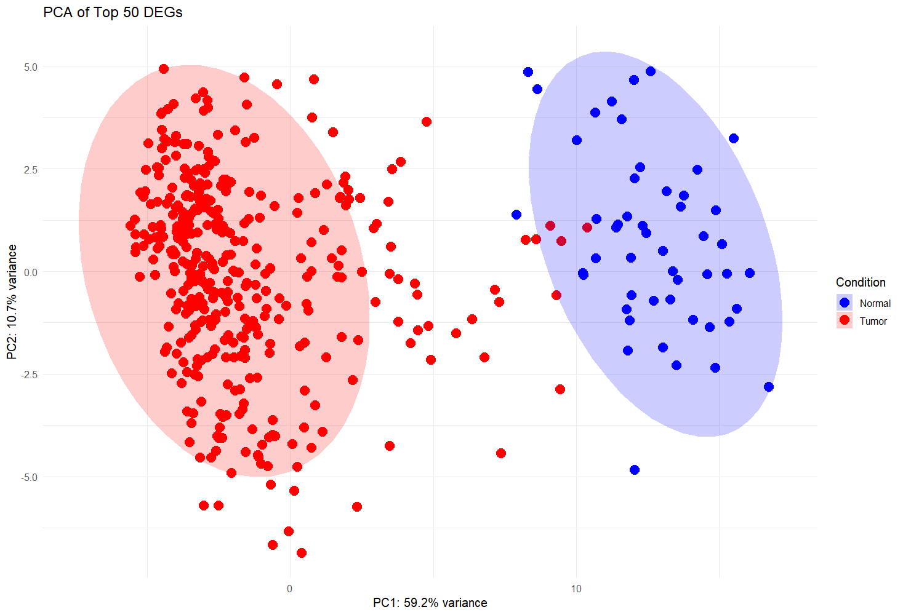
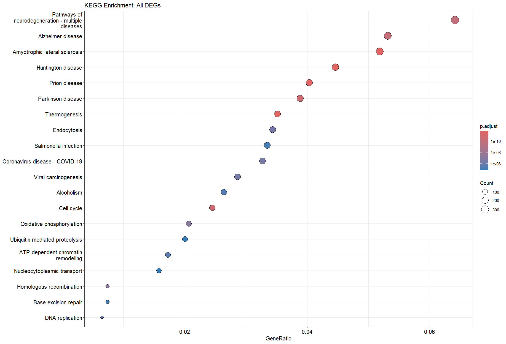
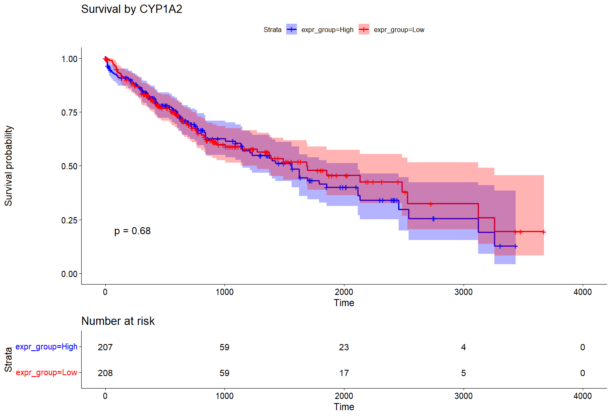

# TCGA-LIHC-Transcriptomic-Survival-Analysis
**Project Summary**
This project analyzes TCGA-LIHC STAR-aligned RNA-seq data to identify differentially expressed genes, interpret dysregulated biological pathways, and evaluate prognostic biomarkers using survival analysis. The focus is on combining statistical rigor, biological interpretation, and clinical relevance.

**Dataset**
424 samples (371 tumor, 53 normal)
STAR-aligned, log₂-normalized gene-level expression

**Tools**
R, limma, edgeR, clusterProfiler, ReactomePA, enrichplot, survminer

**Analysis Overview**
Differential Expression
Tumor vs Normal comparison using limma
DEGs defined as FDR < 0.05 and |log₂FC| > 1
Clear tumor-normal separation observed in volcano plots, heatmaps, and PCA

Functional Enrichment
GO, KEGG, and Reactome pathway analysis
GSEA performed on ranked gene lists
Enrichment highlights cell-cycle activation, genomic instability, metabolic reprogramming, and immune dysregulation in LIHC

Candidate Gene Prioritization
Strong DEGs filtered using stringent thresholds (|log₂FC| > 2, FDR < 1e-10)
Further refined using GO and Reactome pathway support
Biologically relevant candidates identified (e.g., CYP1A2)

Survival Analysis
Expression data integrated with TCGA clinical survival information
Kaplan–Meier and Cox proportional hazards models applied
Systematic survival screening identified STAB2 as a protective prognostic marker
(HR = 0.73, p = 0.046; high expression associated with improved survival)

**Key Take-Home Message**
This analysis integrates differential expression, pathway enrichment, and survival modeling to identify biologically meaningful and clinically relevant molecular features of hepatocellular carcinoma.

## Results & Interpretation
Differential Expression & Visualization

Fig.1: Volcano plot- Genes were considered significantly differentially expressed based on an adjusted p-value (FDR, Benjamini–Hochberg) < 0.05 and an absolute log₂ fold change > 1, ensuring both statistical significance and biological relevance. Genes were classified as upregulated or downregulated depending on their relative expression in tumor versus normal liver samples.
The volcano plot summarizes differential expression results, with the x-axis representing log₂ fold change and the y-axis representing −log₁₀ adjusted p-value. Vertical dashed lines indicate the fold-change threshold (|log₂FC| = 1), and the horizontal dashed line denotes the FDR cutoff (0.05). Genes outside these thresholds represent the most confident and biologically meaningful differentially expressed genes.
The analysis reveals extensive transcriptional dysregulation in TCGA-LIHC tumors. Several genes associated with cell cycle progression and oncogenic signaling, including PLVAP, CDC25C, and UBE2T, are strongly upregulated. In contrast, liver-specific and endothelial genes such as CLEC4M, CLEC1B, and GDF2 are markedly downregulated, reflecting loss of normal hepatic and vascular functions. Together, these patterns highlight key molecular alterations underlying hepatocellular carcinoma.

Fig.2: Heatmap- This heatmap shows the top 50 most significant DEGs between tumor and normal liver samples. Rows are genes, columns are samples, and values are Z-score scaled per gene. The clustering clearly separates tumor and normal samples, indicating strong biological signal. Upregulated genes show higher expression in tumors, while downregulated genes reflect loss of normal liver functions.

Fig.3: PCA plot- Principal Component Analysis of the top 50 differentially expressed genes shows clear separation between TCGA-LIHC tumor and normal samples. PC1 explains 59.2% of the variance and distinctly separates tumor from normal tissue, indicating that disease status is the dominant source of transcriptional variation. Tumor samples exhibit greater heterogeneity compared to normal liver tissue, reflecting known biological diversity in hepatocellular carcinoma.

Functional Enrichment (GO / KEGG / Reactome / GSEA)

Fig.4: GO dotplot- Gene Ontology (GO) enrichment analysis was performed on all significantly differentially expressed genes using the clusterProfiler package. Biological Process (BP) terms were predominantly enriched. 
The analysis revealed strong enrichment of cell cycle–related processes, including chromosome segregation, mitotic nuclear division, and spindle organization, indicating enhanced proliferative activity in tumor samples. Additionally, several DNA replication and repair–associated processes were enriched, reflecting increased genomic instability and replication stress characteristic of hepatocellular carcinoma.
Notably, RNA processing and ribosome biogenesis pathways were also significantly enriched, suggesting elevated transcriptional and translational activity to support rapid tumor growth. The low adjusted p-values and high gene ratios across these terms demonstrate robust and biologically meaningful enrichment.

Fig.5: KEGG dotplot- KEGG pathway enrichment analysis was performed on all significantly differentially expressed genes using clusterProfiler. The results revealed strong enrichment of pathways associated with cell cycle regulation, DNA replication, DNA repair, and chromatin remodeling, indicating enhanced proliferative and genomic maintenance activity in tumor samples.
Metabolic pathways such as oxidative phosphorylation and alcoholism were also enriched, reflecting metabolic reprogramming and known etiological factors associated with hepatocellular carcinoma. Viral carcinogenesis and infection-related pathways were enriched, consistent with the established role of viral infections and immune signaling in liver cancer development.
Interestingly, several neurodegeneration-related pathways were identified, which share common molecular mechanisms with cancer, including mitochondrial dysfunction, oxidative stress, and ubiquitin-mediated proteolysis. Overall, these results highlight key oncogenic, metabolic, and stress-response processes driving hepatocellular carcinoma.

Fig.6: GO emapplot-To further interpret enriched biological processes, redundant GO terms were removed using semantic similarity–based simplification. Pairwise semantic similarities between GO terms were then calculated, and an enrichment map was generated.
In the enrichment map, nodes represent enriched GO terms and edges indicate semantic similarity. Functionally related GO terms clustered together, revealing major biological modules. Prominent clusters corresponded to cell cycle regulation and mitotic processes, DNA replication and genome stability, RNA processing and ribosome biogenesis, and chromatin organization. These modules reflect key oncogenic programs active in hepatocellular carcinoma, including uncontrolled proliferation, genomic instability, and increased biosynthetic activity.
This network-based visualization provides a systems-level view of the biological processes underlying tumor progression.

Fig.7: Reactome dotplot- Reactome pathway enrichment of significant differentially expressed genes revealed strong activation of cell cycle, mitotic progression, RNA processing, and DNA repair pathways, highlighting proliferation-driven molecular mechanisms in LIHC.

Fig.8: Reactome GSEA dotplot-GSEA highlights coordinated dysregulation of cell-cycle control, liver-specific detoxification pathways, immune signaling, and metabolic processes, which together capture the biological complexity of hepatocellular carcinoma.

Fig.9: GSEA reactome Score plot- GSEA revealed significant negative enrichment of the Complement Cascade pathway, indicating coordinated downregulation of complement-related immune genes in tumor samples, suggesting suppression of innate immune responses in LIHC.

Survival Analysis

Part-1: Pathway-Guided Candidate Gene Analysis
After identifying differentially expressed genes in TCGA-LIHC, I integrated RNA-seq expression data with overall survival information using TCGA patient barcodes. Instead of testing all genes, I used a biologically informed filtering strategy—prioritizing genes with strong differential expression that also appeared in GO and Reactome pathway enrichment results. This allowed me to focus on pathway-supported, disease-relevant candidates. I then selected CYP1A2 as the top gene based on effect size and pathway relevance. For survival analysis, I stratified patients into high- and low-expression groups and evaluated prognostic impact using Kaplan–Meier curves and Cox proportional hazards regression.

Although CYP1A2 expression shows a visible separation trend between groups at later time points, the log-rank p-value (p = 0.68) indicates that this difference is not statistically significant in this cohort. This suggests that CYP1A2 alone may not be a strong independent prognostic marker for overall survival in TCGA-LIHC.

Part-2: Systematic Survival Screening
After initial survival analysis of CYP1A2 showed no statistically significant association with overall survival, the analysis was extended to the top pathway-supported, strongly differentially expressed genes. Each candidate gene was systematically evaluated using a consistent Cox proportional hazards model after matching RNA-seq expression data with TCGA-LIHC clinical survival information. This unbiased screening approach enabled objective identification of genes with potential prognostic relevance, leading to the selection of STAB2 for further survival analysis.

High STAB2 expression was associated with improved overall survival in TCGA-LIHC patients (HR < 1, p < 0.05), indicating a potential protective effect. STAB2 is involved in liver endothelial and scavenger receptor functions, suggesting that preservation of normal hepatic clearance and endothelial activity may contribute to better clinical outcomes in hepatocellular carcinoma.

